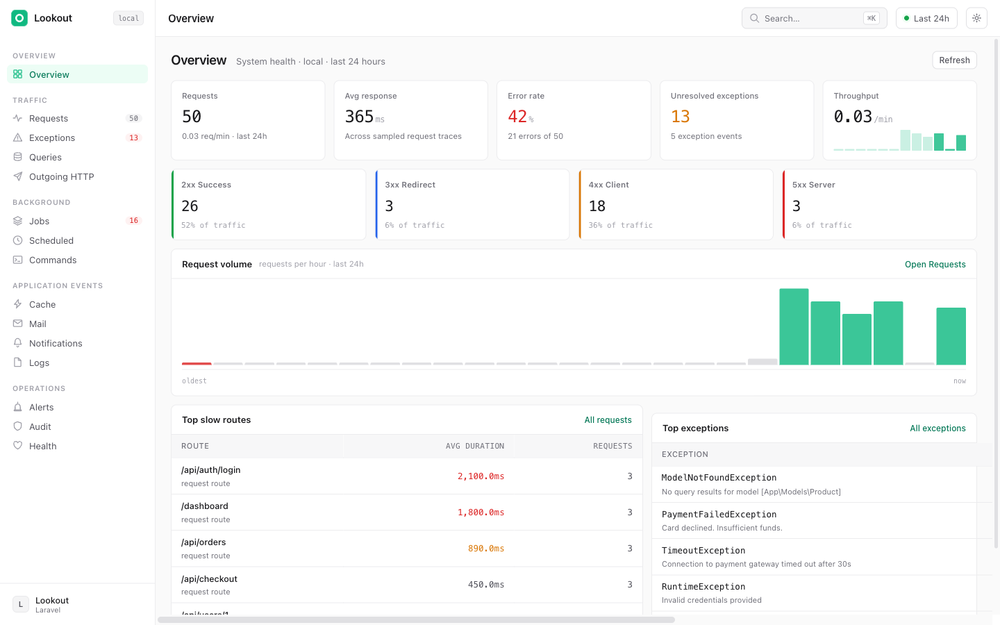

# Lookout

Self-hosted, Laravel-native observability for requests, exceptions, queries, jobs, commands, scheduled tasks, cache, mail, notifications, logs, and outgoing HTTP calls.

Lookout is designed for teams that want production-grade visibility inside their Laravel application without sending traces, payload metadata, exception groups, or operational audit data to a third-party SaaS by default. It ships with a polished dashboard, configurable storage drivers, redaction controls, queue-based ingestion, audit logging, alert delivery telemetry, and a small authenticated JSON API.



## Contents

- [What Lookout Gives You](#what-lookout-gives-you)
- [Requirements](#requirements)
- [Installation](#installation)
- [Dashboard Access](#dashboard-access)
- [How Ingestion Works](#how-ingestion-works)
- [Storage Drivers](#storage-drivers)
- [Dashboard Guide](#dashboard-guide)
- [Configuration Reference](#configuration-reference)
- [API Reference](#api-reference)
- [Alerting](#alerting)
- [Privacy and Redaction](#privacy-and-redaction)
- [Retention and Pruning](#retention-and-pruning)
- [Production Checklist](#production-checklist)
- [Development](#development)
- [Troubleshooting](#troubleshooting)

## What Lookout Gives You

Lookout records the operational signals that usually require a mix of external tools, log digging, queue inspection, and manual exception tracking.

| Area | What is captured | Where it appears |
| --- | --- | --- |
| HTTP requests | Route/name, method, status, duration, memory, user id, headers, bounded body metadata, child events | Overview, Requests, Request Detail |
| Exceptions | Exception class, message, file, line, fingerprint, recurrence count, status lifecycle | Overview, Exceptions, Exception Detail |
| SQL queries | SQL text, connection, bindings, duration, slow-query distribution | Queries, Request Detail |
| Outgoing HTTP | Method, URL, response status, duration, connection failures | Outgoing HTTP, Request Detail |
| Queue jobs | Processed and failed jobs, payload metadata, failure state | Jobs, Request/Job traces |
| Scheduled tasks | Foreground and background scheduled runs, failures, duration, exit status | Scheduled |
| Artisan commands | Top-level and nested command traces | Commands |
| Cache | Hits, misses, writes, forgets, store name, redacted key labels | Cache |
| Mail | Mailable/message metadata, recipients, subject, delivery events | Mail |
| Notifications | Notification class, channel, notifiable metadata | Notifications |
| Logs | Log level, message, context | Logs |
| Audit | Dashboard mutations, pruning, alert triggers, exportable audit trail | Audit |
| Health | Storage driver, counts, payload budget, retention-related state | Health |

Key advantages:

- Runs inside Laravel and follows Laravel conventions.
- Stores data in your own infrastructure.
- Uses SQLite by default for a low-friction local setup.
- Supports host-managed MySQL and PostgreSQL storage.
- Keeps the dashboard disabled in production unless explicitly enabled.
- Redacts sensitive keys, headers, query strings, path tokens, cache keys, mail metadata, logs, and free-form strings through a central redaction pipeline.
- Uses queue-based ingestion so recording does not become the main request path bottleneck.
- Provides both visual dashboards and a token-protected API.

## Requirements

- PHP `^8.2`
- Laravel components `^11.0`, `^12.0`, or `^13.0`
- `ext-pdo_sqlite`
- A Laravel queue connection for asynchronous ingestion
- A database option for Lookout storage:
  - Managed SQLite, the default
  - Existing MySQL connection
  - Existing PostgreSQL connection

The package currently requires `ext-pdo_sqlite` because SQLite is the default managed storage driver, even if you later configure MySQL or PostgreSQL storage.

## Installation

Install the package:

```bash
composer require zasetsu/lookout
```

Run the installer:

```bash
php artisan lookout:install
```

The install command:

- Publishes the configuration file.
- Publishes Lookout migrations.
- Creates the managed SQLite database file when the SQLite driver is used.
- Runs Lookout migrations on the configured Lookout storage connection.
- Publishes dashboard assets.

Start the Lookout worker:

```bash
php artisan lookout:work
```

Then open the dashboard:

```text
/lookout
```

For a local sandbox-style setup:

```env
LOOKOUT_ENABLED=true
LOOKOUT_DASHBOARD_ENABLED=true
LOOKOUT_LOCALHOST_ONLY=true
LOOKOUT_STORAGE_DRIVER=sqlite
LOOKOUT_STORAGE_CONNECTION=lookout
LOOKOUT_QUEUE=default
```

## Dashboard Access

Lookout intentionally returns `404` when the dashboard is disabled or when no dashboard authorization layer has been configured. That keeps accidental production exposure harder.

You must configure at least one access layer:

### Localhost Only

Best for local development:

```env
LOOKOUT_DASHBOARD_ENABLED=true
LOOKOUT_LOCALHOST_ONLY=true
```

Only `127.0.0.1` and `::1` are accepted.

### Basic Auth

Good for simple private environments behind TLS:

```env
LOOKOUT_DASHBOARD_ENABLED=true
LOOKOUT_BASIC_AUTH_USER=admin
LOOKOUT_BASIC_AUTH_PASS="use-a-long-random-password"
```

### IP Allow List

Useful behind a trusted network boundary:

```env
LOOKOUT_DASHBOARD_ENABLED=true
LOOKOUT_ALLOWED_IPS=127.0.0.1,10.0.0.5,203.0.113.10
```

Comma-separated values are trimmed automatically.

### Gate Authorization

Use Laravel authorization when the dashboard should be tied to authenticated users:

```php
use Illuminate\Support\Facades\Gate;

Gate::define('viewLookout', function ($user = null) {
    return $user?->is_admin === true;
});
```

If a `viewLookout` Gate exists, Lookout uses it. A denied Gate returns `404`.

## How Ingestion Works

Lookout prepends its trace bootstrap middleware to the `web` and `api` middleware groups. That allows it to capture events that occur early in the request lifecycle, including database, cache, log, and outgoing HTTP work performed by application middleware.

At the end of a sampled trace, Lookout flushes the trace buffer and dispatches an ingestion job:

```text
Laravel event/listener activity
        -> recorder
        -> TraceBuffer
        -> terminating callback
        -> IngestTraceJob
        -> StorageContract
```

The ingestion job stores:

- One trace row in `lookout_traces`
- Zero or more child events in `lookout_events`
- Exception group updates in `lookout_exception_groups`
- Alert/audit records when configured

Run a worker with:

```bash
php artisan lookout:work
```

Options:

```bash
php artisan lookout:work --queue=lookout --tries=3
```

Relevant queue configuration:

```env
LOOKOUT_QUEUE=lookout
LOOKOUT_QUEUE_CONNECTION=redis
```

If `LOOKOUT_QUEUE_CONNECTION` is empty, Lookout uses Laravel's default queue connection.

## Storage Drivers

Lookout supports a storage contract with multiple SQL-backed implementations.

### Default SQLite

SQLite is the default and is recommended for local development, demos, low-volume apps, and quick adoption.

```env
LOOKOUT_STORAGE_DRIVER=sqlite
LOOKOUT_STORAGE_CONNECTION=lookout
LOOKOUT_STORAGE_PATH=/absolute/path/to/storage/lookout/lookout.sqlite
```

When SQLite is selected, Lookout registers a managed Laravel database connection using `LOOKOUT_STORAGE_CONNECTION`, creates the database file during `lookout:install`, and stores all observability data there.

### Existing App Database

Use MySQL:

```env
LOOKOUT_STORAGE_DRIVER=mysql
LOOKOUT_STORAGE_CONNECTION=mysql
```

Use PostgreSQL:

```env
LOOKOUT_STORAGE_DRIVER=pgsql
LOOKOUT_STORAGE_CONNECTION=pgsql
```

In this mode, Lookout uses your existing Laravel database connection and does not create a SQLite file.

### Dedicated Lookout Connection

You can define a normal Laravel database connection named `lookout` and point Lookout at it:

```env
LOOKOUT_STORAGE_DRIVER=pgsql
LOOKOUT_STORAGE_CONNECTION=lookout
```

The package migrations run against `LOOKOUT_STORAGE_CONNECTION`.

### Storage Migration Note

Lookout does not automatically migrate existing observability data between storage drivers. Choose the driver before enabling the package in a persistent environment, or migrate the `lookout_*` tables manually.

## Dashboard Guide

The dashboard is available at the configured `LOOKOUT_PATH`, which defaults to `/lookout`.

### Overview

The first page summarizes request volume, average response time, error rate, unresolved exceptions, throughput, status-code distribution, top slow routes, and top exception groups.

### Requests

Shows sampled HTTP request traces.

Available filters:

- `status`: `success` or `error`
- `method`: `GET`, `POST`, `PUT`, `PATCH`, `DELETE`, `OPTIONS`, `HEAD`
- `route`: route/name/path search
- `response_status`: numeric HTTP status from `100` to `599`
- `min_duration`: minimum duration in milliseconds
- `since`: relative window such as `24h`, `7d`, or `-24 hours`

Clicking a request opens the request detail page.

### Request Detail

Displays the selected trace with metadata, request context, response status, memory, duration, and child events. Child events include queries, cache events, outgoing HTTP calls, exceptions, mail, jobs, and other events recorded during the trace.

### Exceptions

Groups failures by fingerprint and tracks recurrence.

Available filters:

- `status`: `unresolved`, `resolved`, or `ignored`
- `class`: exception class search

Operators can resolve or ignore exception groups. These actions are written to the audit log.

### Exception Detail

Shows the grouped exception class, message, file, line, count, first seen, last seen, current status, and operational actions.

### Queries

Shows slow SQL events with connection, SQL, bindings, duration, trend data, and duration buckets.

Available filter:

- `threshold`: minimum query duration in milliseconds

### Outgoing HTTP

Shows outbound HTTP requests and connection failures. Failed connection attempts are counted as failures even when there is no response status.

### Jobs

Shows processed and failed queue jobs, job names, status, payload metadata, and failure details.

### Scheduled

Shows scheduled task traces, including background scheduled task completion and failed scheduled callbacks.

### Commands

Shows Artisan command traces, including nested command calls.

### Cache

Shows cache hits, misses, writes, forgets, hit rate, store names, redacted keys, and recent cache event activity.

### Mail

Shows mail events, subjects, recipients, and related metadata after redaction.

### Notifications

Shows notification class names, channels, and notifiable metadata after redaction.

### Logs

Shows application log events with level counts and expandable payload/context details.

### Alerts

Shows threshold rule management, trigger history, and per-channel delivery telemetry. The default tab is `Rules`, where operators can create, edit, enable, disable, delete, dry-run evaluate, and manually dispatch threshold rules. `Trigger History` shows recorded alert deliveries, and `Delivery` shows configured alert channels with safe test actions.

### Audit

Shows dashboard mutations, pruning runs, alert triggers, user id, IP address, details, and supports CSV/JSON export.

Export URLs:

```text
/lookout/audit/export?format=csv
/lookout/audit/export?format=json
```

### Health

Shows storage driver health, trace/event counts, recent activity, request body budget statistics, and storage metadata.

### Interface Controls

The dashboard also includes:

- Sidebar navigation grouped by operational domain.
- Dynamic nav counts for high-signal areas.
- Command palette via `Cmd+K` or `Ctrl+K`.
- Light/dark theme switch.
- Compact/cozy density switch.
- Accent color selection.
- Mobile sidebar navigation.

## Configuration Reference

Publish and edit the config file:

```bash
php artisan vendor:publish --tag=lookout-config
```

### Top-Level

| Config | Env | Default | Description |
| --- | --- | --- | --- |
| `lookout.enabled` | `LOOKOUT_ENABLED` | `true` | Enables or disables all package boot behavior. |

### Dashboard

| Config | Env | Default | Description |
| --- | --- | --- | --- |
| `dashboard.enabled` | `LOOKOUT_DASHBOARD_ENABLED` | `! app()->isProduction()` | Registers the dashboard routes when enabled. |
| `dashboard.path` | `LOOKOUT_PATH` | `lookout` | URL prefix for dashboard and API routes. |
| `dashboard.middleware` | none | `['web']` | Middleware group applied to dashboard routes. |
| `dashboard.allowed_ips` | `LOOKOUT_ALLOWED_IPS` | empty | Comma-separated allow list. |
| `dashboard.localhost_only` | `LOOKOUT_LOCALHOST_ONLY` | `false` | Allows only localhost clients. |
| `dashboard.basic_auth.user` | `LOOKOUT_BASIC_AUTH_USER` | `null` | Basic auth username. |
| `dashboard.basic_auth.pass` | `LOOKOUT_BASIC_AUTH_PASS` | `null` | Basic auth password. |
| `dashboard.rate_limit` | none | `60` | Dashboard throttle limit. |

### API

| Config | Env | Default | Description |
| --- | --- | --- | --- |
| `api.enabled` | `LOOKOUT_API_ENABLED` | `false` | Registers token-protected API routes. |
| `api.token` | `LOOKOUT_API_TOKEN` | `null` | Bearer token required by the API. |

### Storage

| Config | Env | Default | Description |
| --- | --- | --- | --- |
| `storage.driver` | `LOOKOUT_STORAGE_DRIVER` | `sqlite` | `sqlite`, `mysql`, or `pgsql`. |
| `storage.connection` | `LOOKOUT_STORAGE_CONNECTION` | `lookout` | Laravel database connection used by Lookout. |
| `storage.path` | `LOOKOUT_STORAGE_PATH` | `storage_path('lookout/lookout.sqlite')` | SQLite path for managed SQLite storage. |
| `storage.pragmas.journal_mode` | none | `WAL` | SQLite journal mode. |
| `storage.pragmas.synchronous` | none | `NORMAL` | SQLite synchronous pragma. |
| `storage.pragmas.cache_size` | none | `-64000` | SQLite cache size. |
| `storage.pragmas.mmap_size` | none | `268435456` | SQLite mmap size. |
| `storage.pragmas.temp_store` | none | `MEMORY` | SQLite temporary storage mode. |

### Ingestion

| Config | Env | Default | Description |
| --- | --- | --- | --- |
| `ingestion.queue` | `LOOKOUT_QUEUE` | `default` | Queue name for ingestion jobs. |
| `ingestion.connection` | `LOOKOUT_QUEUE_CONNECTION` | `null` | Queue connection override. |
| `ingestion.batch_size` | none | `100` | Internal batch sizing setting. |
| `ingestion.sync_exceptions` | `LOOKOUT_EXCEPTION_SYNC` | `true` | Allows exception persistence to be synchronized with final trace flushing. |
| `ingestion.max_request_body_bytes` | `LOOKOUT_MAX_REQUEST_BODY_BYTES` | `16384` | Maximum captured request body size before truncation metadata is stored. |

### Sampling

| Config | Env | Default | Description |
| --- | --- | --- | --- |
| `sampling.auto` | `LOOKOUT_AUTO_SAMPLE` | `true` | Enables automatic request sampling. |
| `sampling.request` | `LOOKOUT_REQUEST_SAMPLE_RATE` | `null` | Explicit request sample rate. |
| `sampling.command` | `LOOKOUT_COMMAND_SAMPLE_RATE` | `1.0` | Command sample rate. |
| `sampling.scheduled_task` | `LOOKOUT_SCHEDULED_SAMPLE_RATE` | `1.0` | Scheduled task sample rate. |
| `sampling.exception` | `LOOKOUT_EXCEPTION_SAMPLE_RATE` | `1.0` | Exception sample rate. |

Sample rates are decimal values between `0.0` and `1.0`.

### Filters

| Config | Default | Description |
| --- | --- | --- |
| `filters.ignore_routes` | Lookout dashboard/API, Horizon, Telescope, Debugbar | Request routes that should not be traced. |
| `filters.ignore_commands` | `schedule:run`, `queue:work`, `lookout:*` | Commands that should not be traced. |

### Redaction

| Config | Default | Description |
| --- | --- | --- |
| `redaction.patterns` | `password`, `token`, `secret`, `api_key`, `authorization`, `credit_card`, `ssn`, `cvv`, `cookie`, `laravel_session`, `remember_web`, `xsrf-token` | Built-in sensitive data markers. |
| `redaction.custom` | empty | Additional sensitive markers for your application. |

### Recorders

Each recorder can be enabled or disabled:

| Config | Default |
| --- | --- |
| `recorders.request` | `true` |
| `recorders.query` | `true` |
| `recorders.exception` | `true` |
| `recorders.job` | `true` |
| `recorders.scheduled_task` | `true` |
| `recorders.command` | `true` |
| `recorders.cache` | `true` |
| `recorders.mail` | `true` |
| `recorders.notification` | `true` |
| `recorders.log` | `true` |
| `recorders.outgoing_http` | `true` |

Even if the request recorder is disabled, request contexts may still exist for trace lifecycle purposes. Sensitive headers are redacted at context creation.

### Retention

| Config | Env | Default | Description |
| --- | --- | --- | --- |
| `retention.days` | `LOOKOUT_RETENTION_DAYS` | `14` | Number of days retained by pruning. |
| `retention.prune_chance` | none | `1000` | Reserved probability-style setting for opportunistic pruning. |

### Alerting

| Config | Env | Default | Description |
| --- | --- | --- | --- |
| `alerting.enabled` | `LOOKOUT_ALERTING_ENABLED` | `false` | Enables threshold evaluation. |
| `alerting.channels.email` | `LOOKOUT_ALERT_EMAIL` | `null` | Email destination. |
| `alerting.channels.slack` | `LOOKOUT_ALERT_SLACK_WEBHOOK` | `null` | Slack webhook URL. |
| `alerting.channels.webhook` | `LOOKOUT_ALERT_WEBHOOK_URL` | `null` | Generic webhook URL. |

## API Reference

The API is disabled by default. Enable it with:

```env
LOOKOUT_API_ENABLED=true
LOOKOUT_API_TOKEN="a-long-random-token"
```

All API routes use the same path prefix as the dashboard:

```text
/lookout/api/*
```

Authenticate with:

```http
Authorization: Bearer your-token
```

### `GET /lookout/api/health`

Returns storage health information.

```bash
curl -H "Authorization: Bearer $LOOKOUT_API_TOKEN" \
  https://example.com/lookout/api/health
```

### `GET /lookout/api/summary`

Query parameters:

| Parameter | Description |
| --- | --- |
| `since` | Relative window. Examples: `24`, `24h`, `7d`, `-24 hours`. Positive numeric values are normalized as hours. |

Invalid windows return `422`.

### `GET /lookout/api/requests`

Query parameters:

| Parameter | Description |
| --- | --- |
| `status` | `success` or `error` |
| `method` | HTTP method |
| `route` | Route/name search |
| `response_status` | Numeric status from `100` to `599` |
| `slower_than` | Duration in milliseconds or shorthand such as `250ms`, `1s`, `2m`, `1h` |
| `limit` | `1` to `500`, default `100` |
| `offset` | Pagination offset, default `0` |

Invalid scalar, enum, duration, status, or pagination values return `422`.

### `GET /lookout/api/exceptions`

Query parameters:

| Parameter | Description |
| --- | --- |
| `status` | `unresolved`, `resolved`, or `ignored` |
| `class` | Exception class search |
| `limit` | `1` to `200`, default `50` |
| `offset` | Pagination offset, default `0` |

### `GET /lookout/api/traces/{traceId}`

Returns one trace and its child events.

Missing traces return `404`.

## Alerting

Lookout evaluates alert thresholds after traces are ingested and after synchronized exception persistence when alerting is enabled.

Alert rules can be managed from `Alerts > Rules` in the dashboard. The UI supports:

- Creating and editing threshold rules on dedicated pages
- Enabling and disabling rules
- Hard-deleting rules
- Dry-run evaluating a rule against current storage metrics
- Manually dispatching a rule when its condition is currently met
- Testing configured delivery channels from the Delivery tab
- Auditing every operator action

Supported threshold metrics:

| Metric | Meaning |
| --- | --- |
| `request_duration` | Average request duration in the threshold window. |
| `request_duration_p95` | 95th percentile request duration in the threshold window. |
| `exception_count` | Number of exception events in the threshold window. |
| `slow_query_count` | Number of query events at or above `500ms` in the threshold window. |
| `failed_job_count` | Number of failed job events in the threshold window. |
| `error_rate` | Percentage of request traces with `response_status >= 400` in the threshold window. |
| `outgoing_http_failure_count` | Number of outgoing HTTP events with `failed=true` or `response_status >= 400`. |

Supported conditions:

```text
gt, gte, lt, lte, eq
```

Each rule has:

| Field | Meaning |
| --- | --- |
| `name` | Operator-facing rule name. |
| `metric` | One of the supported metrics above. |
| `condition` | `gt`, `gte`, `lt`, `lte`, or `eq`. |
| `value` | Numeric threshold value. |
| `window_minutes` | Metric lookback window, from `1` to `1440` minutes in the dashboard. |
| `cooldown_minutes` | Minimum time between dispatches for the same rule, from `1` to `10080` minutes in the dashboard. |
| `channels` | Any configured subset of `email`, `slack`, and `webhook`. |
| `enabled` | Whether automatic evaluation can dispatch this rule. |

The dashboard only allows saving channels that are configured in `config/lookout.php` or the matching env variables. Channel destinations are masked in the UI so webhook credentials are not exposed.

Thresholds are stored in `lookout_thresholds`. Example seed:

```php
DB::connection(config('lookout.storage.connection', 'lookout'))
    ->table('lookout_thresholds')
    ->insert([
        'name' => 'High exception volume',
        'metric' => 'exception_count',
        'condition' => 'gte',
        'value' => 5,
        'window_minutes' => 15,
        'cooldown_minutes' => 30,
        'channels' => json_encode(['slack', 'webhook']),
        'enabled' => true,
        'created_at' => now(),
        'updated_at' => now(),
    ]);
```

Cooldown claims are atomic at the storage layer, so concurrent workers do not dispatch duplicate notifications during the configured cooldown window.

Audit actions include:

| Action | Meaning |
| --- | --- |
| `threshold_rule_created` | Operator created a rule. |
| `threshold_rule_updated` | Operator updated a rule. |
| `threshold_rule_enabled` | Operator enabled a rule. |
| `threshold_rule_disabled` | Operator disabled a rule. |
| `threshold_rule_deleted` | Operator deleted a rule. |
| `threshold_rule_evaluated` | Operator dry-run evaluated a rule. |
| `threshold_rule_dispatched` | Operator manually dispatched a rule. |
| `threshold_channel_tested` | Operator tested an alert channel. |
| `threshold_triggered` | Automatic or manual threshold delivery telemetry. |

Delivery outcomes are written to the audit log and displayed on the Alerts page. Failed delivery errors are summarized before persistence so HTTP response bodies and transport details are not stored in dashboard audit exports.

## Privacy and Redaction

Lookout is built to reduce accidental sensitive-data persistence.

Redaction applies to:

- Request headers
- Request bodies
- Query bindings and payloads
- Cache keys
- Outgoing HTTP URLs, query parameters, path tokens, and failure URLs
- Mail metadata
- Notification metadata
- Scheduled task commands
- Logs and free-form strings
- CamelCase, snake_case, kebab-case, and bracketed sensitive key forms

Examples of values that are masked by the default policy:

```text
Authorization: Bearer abc.def.ghi
access_token=secret
user[apiKey]=secret
password=secret
creditCard=4111111111111111
/password/reset/super-secret-token
```

Add application-specific patterns:

```php
// config/lookout.php
'redaction' => [
    'custom' => [
        'customer_secret',
        'internal_token',
        'partner_api_key',
    ],
],
```

Request bodies are capped by `LOOKOUT_MAX_REQUEST_BODY_BYTES`. Large bodies are not fully copied into the queued ingestion payload; Lookout stores bounded metadata instead.

## Retention and Pruning

Prune old records manually:

```bash
php artisan lookout:prune
```

Override the configured retention window:

```bash
php artisan lookout:prune --days=30
```

Non-positive retention windows are rejected to avoid destructive deletes caused by bad input.

Recommended scheduler entry:

```php
use Illuminate\Support\Facades\Schedule;

Schedule::command('lookout:prune')->daily();
```

Prune runs are written to the audit log as `prune_run`.

## Data Model

Lookout creates five tables:

| Table | Purpose |
| --- | --- |
| `lookout_traces` | Request, command, scheduled task, and job trace contexts. |
| `lookout_events` | Child events for traces and event-only recorders. |
| `lookout_exception_groups` | Fingerprinted exception group lifecycle. |
| `lookout_thresholds` | Alert threshold definitions. |
| `lookout_audit_log` | Operator actions, pruning, alert delivery telemetry. |

## Production Checklist

Before enabling Lookout in production:

- Set `LOOKOUT_DASHBOARD_ENABLED=true` only when the dashboard is intentionally exposed.
- Configure at least one dashboard access layer: Gate, Basic Auth, IP allow list, or localhost-only access through a tunnel.
- Use HTTPS when Basic Auth is enabled.
- Set `LOOKOUT_API_ENABLED=true` only when needed.
- Use a long random `LOOKOUT_API_TOKEN`.
- Move ingestion to a real queue connection such as Redis, database, SQS, or another production queue.
- Run a dedicated Lookout worker or include the Lookout queue in your worker topology.
- Choose the storage driver before collecting persistent data.
- Consider MySQL or PostgreSQL for higher-volume production apps.
- Review `LOOKOUT_MAX_REQUEST_BODY_BYTES` for your payload profile.
- Add custom redaction markers for domain-specific secrets.
- Schedule `lookout:prune`.
- Publish assets during deploy when package assets change:

```bash
php artisan vendor:publish --tag=lookout-assets --force
```

## Development

Install dependencies:

```bash
composer install
npm install
```

Build dashboard assets:

```bash
npm run build
```

Run tests:

```bash
composer test
```

Run static analysis:

```bash
composer analyse
```

Run formatting checks:

```bash
composer lint
```

Fix formatting:

```bash
composer lint:fix
```

## Troubleshooting

### `/lookout` returns 404

Check:

- `LOOKOUT_ENABLED=true`
- `LOOKOUT_DASHBOARD_ENABLED=true`
- At least one access layer is configured
- Your `viewLookout` Gate allows the current user, if the Gate exists
- The route prefix matches `LOOKOUT_PATH`

### `/lookout/api/*` returns 404

Check:

- `LOOKOUT_API_ENABLED=true`
- `LOOKOUT_API_TOKEN` is configured
- You are using the dashboard path prefix: `/LOOKOUT_PATH/api/*`

### API returns 401

Check the bearer token:

```bash
curl -H "Authorization: Bearer $LOOKOUT_API_TOKEN" \
  https://example.com/lookout/api/health
```

### No traces appear

Check:

- `LOOKOUT_ENABLED=true`
- The relevant recorder is enabled under `lookout.recorders`
- The route or command is not ignored by filters
- The sample rate is not `0.0`
- A queue worker is running for `LOOKOUT_QUEUE`
- The storage connection is reachable

### Requests are traced but child events are missing

Check whether the recorder for the missing event type is enabled. Also confirm that the event occurs after Laravel boots the application and that the relevant Laravel event is fired by the framework or integration.

### Dashboard assets look stale

Republish assets:

```bash
php artisan vendor:publish --tag=lookout-assets --force
```

Then clear any HTTP/CDN/browser cache in front of the dashboard.

### SQLite file cannot be created

Check:

- `LOOKOUT_STORAGE_PATH` points to a writable directory
- The PHP process can create files in that directory
- `lookout:install` was run after changing the path

### MySQL/PostgreSQL storage does not migrate

Check:

- `LOOKOUT_STORAGE_DRIVER` matches the connection driver
- `LOOKOUT_STORAGE_CONNECTION` exists in `config/database.php`
- The configured database user can create and alter tables
- `php artisan lookout:install` or `php artisan migrate --database=<connection>` has been run

## License

Lookout is open-sourced software licensed under the MIT license.
